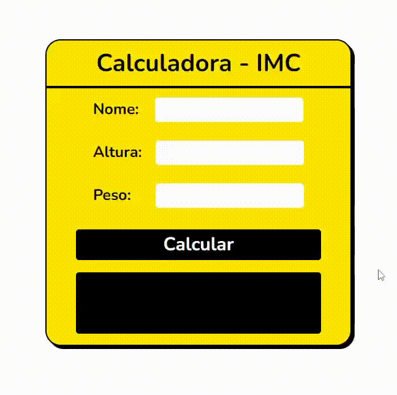
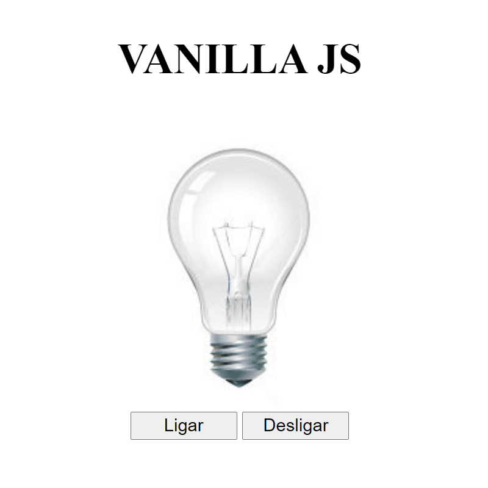
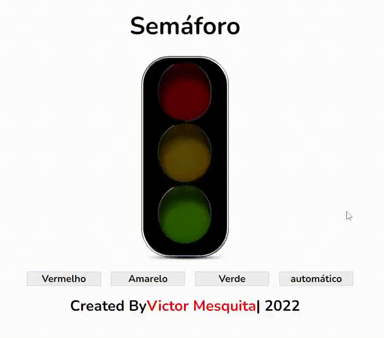
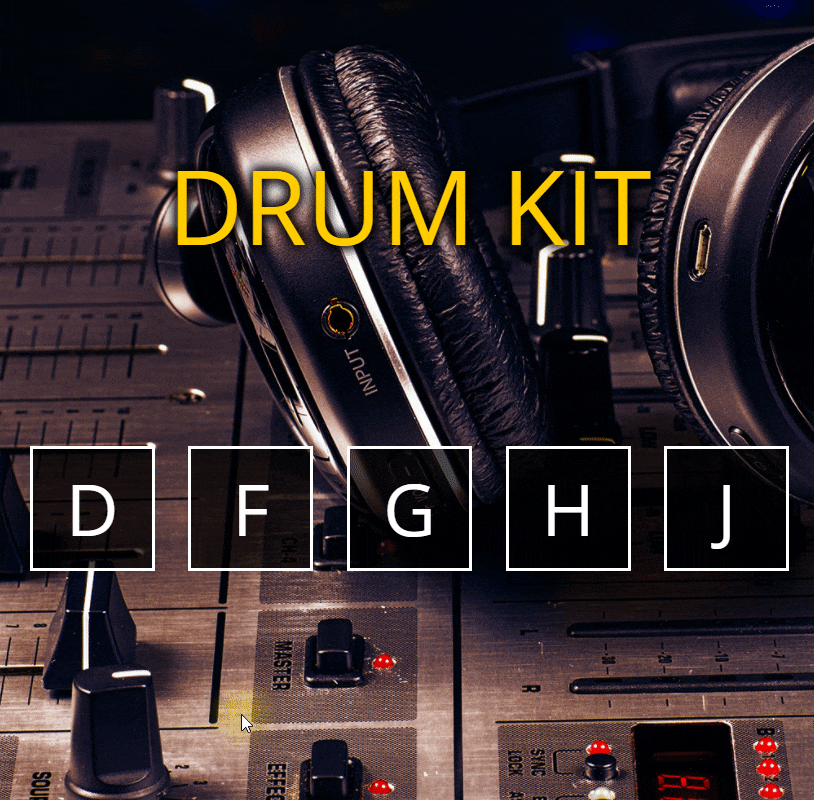
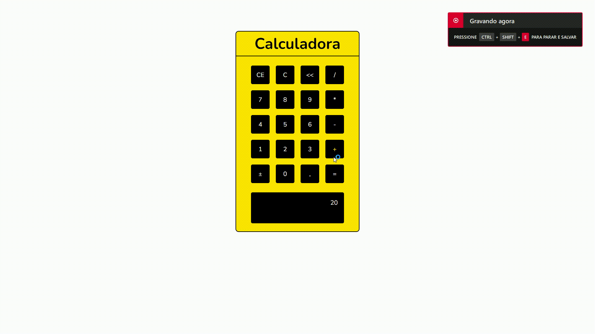
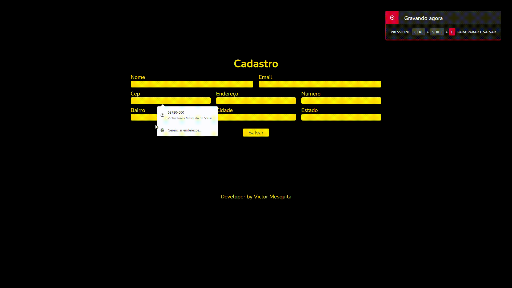
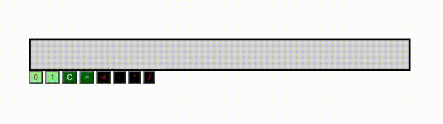

# Mini Projetos com javascript puro

## Objetivo
Não tem outra maneira para se aprender além de **praticar, praticar e praticar**.

Pensando nisso, criei este repositório com objetivo juntar ideias para mini projetos que podem ajudar quem está iniciando no desenvolvimento web utilizando o javascript puro.
Você pode realizar observando o resultado, ou verificando o código, ou ainda acompanhando o desenvolvimento por meio de videos.

**Feitos com o auxilio do Prof Fernando Leonid**

Se gostou da ideia acompanhe os projetos abaixo:

<table border="2">
  <tr>
    <td>
        <h3>00 - Calculadora IMC</h3>
        <li><a href="">Código</a></li>
        
    </td>
      <td>
        <h3>01 - Lâmpada</h3>
        <li><a href="https://github.com/victor-joness/CodeChallenges/tree/main/Fernando%20Leonid%20-%20Challenger/01-Lampada%20em%20Js">Código</a></li>
        
    </td>
    <td>
      <h3>02 - Semáforo</h3>
      <li><a href="">Código</a></li>
      
    </td>
  </tr>
  <tr>
    <td>
      <h3>03 - Slide Show</h3>
      <li><a href="">Código</a></li>
      
    </td>
    <td>
      <h3>04 - Drum-kit</h3>
      <li><a href="">Código</a></li>
      
    </td>
    <td>
      <h3>05 - CountDown</h3>
      <li><a href="">Código</a></li>
      
    </td>
  </tr>
  <tr>
    <td>
      <h3>06 - Calculadora</h3>
      <li><a href="">Código</a></li>
      
    </td>
    <td>
      <h3>07 - To-do-list</h3>
      <li><a href="">Código</a></li>
      
    </td>
    <td>
      <h3>08 - CRUD</h3>
      <li><a href="">Código</a></li>
      
    </td>
  </tr>
  <tr>
    <td>
      <h3>09 - API Cep e Validações</h3>
      <li><a href="">Código</a></li>
      
    </td>
    <td>
      <h3>10 - Player de Musica</h3>
      <li><a href="">Código</a></li>
      
    </td>
    <td>
      <h3>11 - Imagem-Editor</h3>
      <li><a href="">Código</a></li>
      
    </td>
  </tr>
  <tr>
    <td>
      <h3>12 - Calculadora Binaria</h3>
      <li><a href="https://github.com/victor-joness/CodeChallenges/tree/main/Fernando%20Leonid%20-%20Challenger/12-Binary-Calculator">Código</a></li>
      
    </td>
  </tr>
</table>
